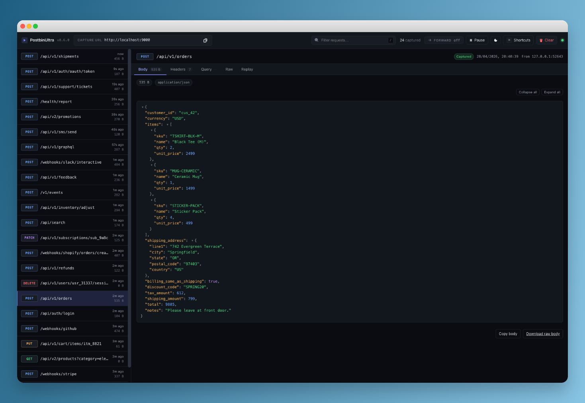

# Postbin Ultra

A local HTTP request inspector for developers. Capture any method, any path, any payload on a port you choose, and inspect every request in real time from your terminal and a live web UI. Built in Rust, ships as a single binary, runs entirely on your machine.

[](https://github.com/MPJHorner/PostbinUltra/actions/workflows/ci.yml)
[](https://github.com/MPJHorner/PostbinUltra/releases/latest)
[](LICENSE)
[](https://www.rust-lang.org)
[](#install)



## Why Postbin Ultra

Most request bins are SaaS tools. You sign up, get a random URL, copy it into the system you're debugging, and wait for traffic to round-trip through the cloud. Postbin Ultra is the local alternative. Point your webhook source, SDK, or test harness at `http://localhost:9000` and every request is captured, decoded, and shown to you immediately. No accounts, no external services, no rate limits, no data leaving your machine.

It's designed for the things developers actually do every day:

- Debugging Stripe, GitHub, Shopify, Slack, Twilio, Sentry, and custom webhooks
- Inspecting what an HTTP client, SDK, or generated API library actually sends
- Reverse-engineering third-party integrations
- Replaying captured requests against a real backend
- Teaching and learning HTTP, headers, multipart, and content encodings

If you've ever reached for `requestbin.com`, `webhook.site`, `ngrok inspect`, `mitmproxy`, or written a one-off Express handler that just `console.log`s the body, Postbin Ultra is the same idea as a single binary you control.

## Features

- Captures any method, any path, any content type. No filters, no surprises.
- Live CLI stream with color-coded methods, timestamp, size, and content type.
- Real-time web UI on a separate port, updated over Server-Sent Events with no refresh.
- Body formatters for JSON (collapsible, syntax-highlighted), form-encoded (key/value table), multipart, `text/*`, `image/*` (inline preview), and binary (hex dump with ASCII gutter).
- Headers preserved exactly, including duplicate header order, so `Set-Cookie` chains stay correct.
- One-click curl rebuild and raw HTTP rebuild for any captured request.
- Replay tab to re-fire a captured request to a target URL from your browser.
- Single binary, around 5 MB, with embedded UI assets. No CDNs, works offline.
- Configurable ports, body cap, ring buffer size, and bind address.
- Automatic port fallback: if `9000` is busy, the next free port is used and the chosen URL is printed.
- Cross-platform: macOS (Intel and Apple Silicon), Linux (x86_64 and arm64), Windows (x86_64).
- 70+ unit and integration tests, 94% line coverage, full end-to-end exercise of every server.

## Install

### Pre-built binaries

Download the latest release from the [releases page](https://github.com/MPJHorner/PostbinUltra/releases/latest) and pick the archive for your platform:

| Platform | Archive |
| --- | --- |
| macOS, Apple Silicon | `postbin-ultra-<version>-aarch64-apple-darwin.tar.gz` |
| macOS, Intel | `postbin-ultra-<version>-x86_64-apple-darwin.tar.gz` |
| Linux, x86_64 | `postbin-ultra-<version>-x86_64-unknown-linux-gnu.tar.gz` |
| Linux, arm64 | `postbin-ultra-<version>-aarch64-unknown-linux-gnu.tar.gz` |
| Windows, x86_64 | `postbin-ultra-<version>-x86_64-pc-windows-msvc.zip` |

Each archive ships with a matching `.sha256` checksum.

```sh
# macOS (Apple Silicon) one-liner
curl -L -o postbin-ultra.tar.gz \
  https://github.com/MPJHorner/PostbinUltra/releases/latest/download/postbin-ultra-aarch64-apple-darwin.tar.gz
tar -xzf postbin-ultra.tar.gz
./postbin-ultra
```

### Cargo

```sh
cargo install --git https://github.com/MPJHorner/PostbinUltra
```

### From source

```sh
git clone https://github.com/MPJHorner/PostbinUltra.git
cd PostbinUltra
cargo build --release
./target/release/postbin-ultra
```

## Quick start

```sh
postbin-ultra
```

No flags needed. The capture server binds `127.0.0.1:9000` and the web UI binds `127.0.0.1:9001`. If either port is busy, Postbin Ultra picks the next free port (up to 50 above the requested one) and prints the URL it actually bound:

```
  ▶ Postbin Ultra v0.1.0
    Capture  http://127.0.0.1:9000   (any method, any path)
    Web UI   http://127.0.0.1:9001
    Buffer   1000 requests · 10 MiB max body

  Waiting for requests… (Ctrl+C to quit)
```

If `9000` was already in use you'd see:

```
  ! capture port 9000 in use, using 9002
```

Use `-p` / `-u` to pin specific ports.

Send anything to the capture URL:

```sh
curl -X POST http://127.0.0.1:9000/webhook \
  -H 'content-type: application/json' \
  -d '{"event":"user.created","id":42}'
```

You'll see it in the terminal:

```
  14:23:45.123  POST     /webhook                                       45 B  application/json          from 127.0.0.1:54321
```

Open `http://127.0.0.1:9001` in your browser to inspect the request in detail: headers, formatted body, query params, a copy-pasteable curl rebuild, and a Replay tab.

## CLI options

```
postbin-ultra [OPTIONS]

  -p, --port <PORT>            Capture port [default: 9000]
  -u, --ui-port <PORT>         Web UI port [default: 9001]
      --bind <ADDR>            Bind address [default: 127.0.0.1]
      --max-body-size <BYTES>  Max captured body size [default: 10485760 = 10 MiB]
      --buffer-size <N>        Requests kept in memory [default: 1000]
      --no-ui                  Disable the web UI server
      --no-cli                 Disable the colored CLI output
      --json                   Emit each request as JSON (NDJSON) to stdout
      --open                   Open the web UI in your browser on startup
  -v, --verbose                Print headers + body preview for each request
      --update                 Download the latest release and replace this binary, then exit
      --no-update-check        Skip the startup check for newer releases
  -h, --help
  -V, --version
```

Examples:

```sh
# Listen on a different port pair
postbin-ultra -p 7777 -u 7778

# Listen on all interfaces (e.g. inside Docker)
postbin-ultra --bind 0.0.0.0

# Pipe machine-readable NDJSON into jq
postbin-ultra --json | jq -r 'select(.method == "POST") | .path'

# Headers + body preview in the terminal
postbin-ultra --verbose

# Headless mode for scripting
postbin-ultra --no-ui --json

# Update to the latest release in place
postbin-ultra --update

# Run without contacting GitHub at startup
postbin-ultra --no-update-check
```

## Updates

Postbin Ultra checks GitHub for a newer release on startup. The check runs in the background with a 3 second timeout, never blocks the banner, and stays silent on offline machines or any other failure. When a newer release exists you will see a one-line notice under the banner.

To upgrade, run:

```sh
postbin-ultra --update
```

This downloads the matching archive from the [latest GitHub release](https://github.com/MPJHorner/PostbinUltra/releases/latest), verifies it, and replaces the running binary in place. Pass `--no-update-check` to disable the startup check entirely.

## Web UI

The UI is hosted on a separate port from the capture server, by default `9001`. It auto-discovers the capture port by probing `ui_port - 1` then `ui_port + 1`. If you've picked unusual ports, override the displayed capture URL with `?capture=PORT` in the address bar.

What you get:

- Two-pane layout: scrollable request list on the left, full detail on the right.
- Tabs: Body, Headers, Query, Raw, Replay.
- Body formatters: JSON (collapsible, highlighted), form-encoded (table), multipart, `text/*` (line-numbered), `image/*` (inline preview), anything else (hex dump with ASCII gutter).
- Keyboard shortcuts (press `?` to view):
  - `j` / `k` next / previous, `g` / `G` newest / oldest, `/` focus search
  - `1` to `5` switch tabs, `p` pause, `c` clear, `t` theme, `?` help
- Theme toggle, dark by default, light mode available, remembered in `localStorage`.
- Pause to freeze the list during a noisy run.
- Replay to re-issue any captured request to a target URL of your choice (browser CORS rules apply).

The UI is plain HTML, CSS, and vanilla JS, embedded into the binary at compile time. No build step, no external CDN, works offline.

## API reference

Postbin Ultra's UI is a client of its own JSON API. You can hit it directly.

| Endpoint | Description |
| --- | --- |
| `GET  /api/health` | `{"status":"ok","version":"0.1.0"}` |
| `GET  /api/requests?limit=N` | Recent requests, newest first. `N` defaults to 100, max 10000. |
| `GET  /api/requests/{id}` | A single captured request including its body. |
| `GET  /api/requests/{id}/raw` | Raw body bytes with the original `Content-Type`. |
| `DELETE /api/requests` | Clears the in-memory buffer. |
| `GET  /api/stream` | Server-Sent Events: `hello` on connect, `request` for each new capture, `cleared` on `DELETE`, `resync` if a slow client falls behind. |

A captured request, JSON-encoded:

```json
{
  "id": "1eea5286-eb49-4c23-b0ed-4159b41e5fa9",
  "received_at": "2026-04-28T12:37:18.570860Z",
  "method": "POST",
  "path": "/webhook",
  "query": "",
  "version": "HTTP/1.1",
  "remote_addr": "127.0.0.1:54321",
  "headers": [
    ["host", "127.0.0.1:9000"],
    ["content-type", "application/json"],
    ["content-length", "59"]
  ],
  "body_truncated": false,
  "body_bytes_received": 59,
  "body_size": 59,
  "body": "{\"event\":\"user.created\",\"id\":42,\"data\":{\"email\":\"x@y.com\"}}",
  "body_encoding": "utf8"
}
```

UTF-8 bodies are returned as a string (`body_encoding: "utf8"`); binary bodies are base64-encoded (`body_encoding: "base64"`). Headers are returned as an ordered list of `[name, value]` tuples so duplicates survive.

## Configuration

| Flag | Env equivalent | Default | Notes |
| --- | --- | --- | --- |
| `--port` | (none) | 9000 | Capture port. If busy, Postbin Ultra walks up to the next free port (up to +50). Pass `0` for an OS-assigned ephemeral port. |
| `--ui-port` | (none) | 9001 | Web UI port. Same auto-fallback behavior as `--port`. |
| `--bind` | (none) | 127.0.0.1 | Set to `0.0.0.0` to accept connections from other machines. |
| `--max-body-size` | (none) | 10 MiB | Bodies above this are truncated. The captured request still records the original byte count and is marked `body_truncated`. |
| `--buffer-size` | (none) | 1000 | Number of recent requests held in memory. Older requests are dropped. |
| `RUST_LOG` | env | `warn,postbin_ultra=info` | Standard `tracing-subscriber` env filter. |

Bodies and the buffer live in RAM only. Restart the binary and history starts fresh.

## Use cases

- **Webhook debugging.** Point a Stripe, GitHub, Shopify, Slack, or Twilio webhook at `http://localhost:9000/whatever` and immediately see what they're sending.
- **API client testing.** Replace the upstream URL in a flaky integration with `postbin-ultra` and capture exactly what your code sends.
- **SDK inspection.** See the real wire format of an SDK call without enabling a verbose debug mode that pollutes your logs.
- **Learning HTTP.** Headers, query strings, multipart parts, and content encodings shown in a readable way.
- **Replay.** Capture a request once, then re-fire it from the UI's Replay tab to your own server.

## Comparison

| | Postbin Ultra | webhook.site / requestbin | ngrok inspect | mitmproxy |
| --- | --- | --- | --- | --- |
| Runs locally | Yes | No | Partial (proxy is local, traffic is tunneled) | Yes |
| No account required | Yes | No | Yes (basic) | Yes |
| Captures any method / path | Yes | Yes | Yes | Yes |
| Pretty body rendering | Yes | Yes | Yes | Partial |
| Replay UI | Yes | Yes | No | Yes |
| Single binary | Yes | n/a | Yes | No (Python) |
| Open source | Yes | No | No | Yes |

## Development

Requires a stable Rust toolchain (1.78+).

A `Makefile` wraps the common tasks. Run `make` (or `make help`) to see them all:

```sh
make run           # cargo run -- -p 9000 -u 9001
make test          # cargo test --all-features
make lint          # fmt-check + clippy with -D warnings
make check         # lint + test (the full pre-commit gate)
make coverage      # cargo-llvm-cov summary
make smoke         # end-to-end smoke test of the release binary
make release       # optimised build at target/release/postbin-ultra
make install       # cargo install --path .
```

If you'd rather drive cargo directly:

```sh
cargo run
cargo test
cargo fmt -- --check
cargo clippy --all-targets --all-features -- -D warnings
cargo install cargo-llvm-cov && cargo llvm-cov --lib --tests --summary-only
```

The codebase is small and structured for tests:

| Module | Responsibility |
| --- | --- |
| `src/request.rs` | `CapturedRequest` model + custom serde for body encoding. |
| `src/store.rs` | In-memory ring buffer + tokio broadcast channel. |
| `src/capture.rs` | axum router with a catch-all fallback. |
| `src/ui.rs` | axum router for the UI: static assets, JSON API, SSE stream. |
| `src/output.rs` | Pretty CLI printer + colour rules. |
| `src/cli.rs` | clap CLI definition + validation. |
| `src/app.rs` | Orchestrates everything: binds servers, spawns printer, owns shutdown. |
| `ui/` | Self-contained HTML, CSS, JS, embedded into the binary. |

## Contributing

Issues and pull requests are welcome. Please run `make check` before submitting a PR. If you're adding a feature, add a test next to it.

## License

[MIT](LICENSE) © 2026 MPJHorner.
